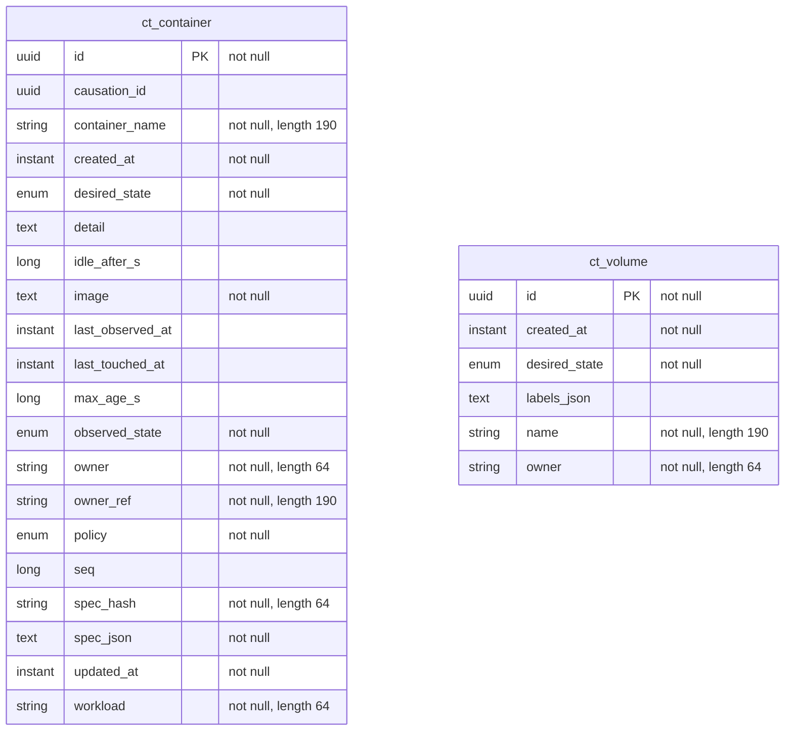

<!-- Generated by `qits database diagram` (jpa). Do not edit: the entity-diagram automation rewrites this file on every release request fold. -->
# Persistence unit `containers`

Datasource `containers` · package `eu.wohlben.qits.containers.entity` · 2 entities

